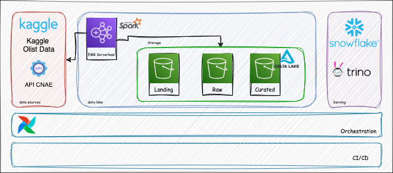

# Olist Report Pipeline

Este repositório contém a minha resolução do case técnico proposto para a posição de Engenheiro de Dados no Grupo Autoglass.

----

# Estrutura do Repositório
Breve descrição sobre a estrutura deste repositório, o que cada pasta contém.

```
├── .github
├── airflow
├── docs
├── infra
├── jobs
├── resources
└── tests
```

## .github
Esta pasta contém os arquivos de configuração das pipelines de CI/CD do projeto, utilizando GitHub Actions.
Para mais detalhes vá até a seção [CI/CD](#cicd).


## airflow
Esta pasta contém todo o conteúdo relacionado à orquestração do pipeline, que foi feito com **Apache Airflow**. 
Inclui a DAG responsável por automatizar o fluxo de dados, bem como as configurações e dependências necessárias para a execução local.
Visando praticidade, o deploy da instancia de Airflow utilizada neste projeto foi feito com Astro CLI e Docker.

### Descrição da Dag
A DAG `olist_report_pipeline` é responsável por orquestrar o processamento de dados no projeto, utilizando **AWS EMR Serverless** como ambiente de execução para os jobs Spark.

O fluxo segue uma estrutura modular, organizada em três grupos principais de tarefas:

- **Landing:** executa a ingestão de dados a partir de uma API para o armazenamento bruto no S3.
- **Raw:** realiza o processamento inicial dos dados brutos, consolidando informações vindas de fontes como API e Kaggle.
- **Curated:** executa transformações finais para gerar datasets curados, como vendas por estado, consolidação de vendas e catálogo de produtos.

Além disso, há uma tarefa inicial para calcular a data de referência do processamento e uma tarefa final que serve para registrar a atualização do dataset curado.


## docs

Pasta utilizada para armazenar as imagens referentes ao projeto.

## infra
Esta pasta contém a infraestrutura AWS utilizada neste projeto. Ela define e provisiona os recursos necessários para o ambiente AWS onde o projeto será executado.

### Recursos criados

- **Buckets S3**
  - Vários buckets para camadas do data lake (`data_lake_buckets`), com política de ciclo de vida para expiração dos objetos após 7 dias quando aplicável.
  - Bucket para código-fonte (`source_code_bucket`) com versionamento habilitado.

- **EMR Serverless**
  - Aplicação EMR Serverless configurada para rodar jobs Spark, com capacidade máxima configurada (4 vCPU, 16 GB RAM, 100 GB disco).
  - Configuração de start/stop automático baseado em uso.

- **IAM**
  - Role IAM para execução dos jobs EMR Serverless, com política que permite ações específicas no S3 e CloudWatch Logs.

- **Rede**
  - VPC principal com suporte DNS habilitado.
  - Sub-rede pública na zona `us-east-1a` com mapeamento de IP público.
  - Gateway de internet associado à VPC.
  - Tabela de rotas pública apontando para o gateway de internet.
  - Associação da tabela de rotas com a sub-rede pública.
  - Security Group permitindo tráfego de entrada e saída irrestrito para a aplicação EMR.

## jobs

Esta pasta armazena os jobs Spark desenvolvidos para este projeto. Para garantir padronização no desenvolvimento, facilitar a execução e simplificar a implementação de testes, foi criada uma classe base chamada `Job`, da qual todos os jobs do projeto herdam.

### Exemplo de Uso
É possível testar o funcionamento dos jobs localmente, seguindo a sequencia de comandos abaixo.
Quando chamado como um package python, este projeto espera receber o caminho até o job a ser executado e a data de referencia para que o job está rodando.

#### Pre Requisitos
- python 3.11^
- poetry

```bash
# instala as dependencias do projeto
poetry install --no-root

# copie o layout de example.env para o arquivo .env e preencha os valores
cp .env example.env

# habilite as variaveis de ambiente necessarias
source .env

# rode algum job
poetry run python -m jobs.main landing.kaggle_to_s3 '2025-05-23'
```

## resources
Armazena dos dados utilizados no projeto(Kaggle).

## tests
Esta pasta contém os testes automatizados do projeto. A estrutura está organizada por pacotes e funcionalidades, refletindo a hierarquia dos jobs Spark, especialmente os jobs da camada `curated`. Cada subpasta possui seus próprios testes  utilizando frameworks como pytest e syrupy.

----

# Arquitetura Proposta
A arquitetura proposta segue conforme a imagem descrita abaixo:



## Transformação

Considerando os requisitos do desafio, uso de Apache Spark e execução na plataforma AWS, avaliamos três possibilidades para realizar a transformação dos dados:

- **Amazon EMR Cluster**
- **Amazon EMR Serverless**
- **Amazon Glue ETL**

Levando em conta a familiaridade com o Spark nativo, bem como o volume e a complexidade relativamente **baixos** dos workloads solicitados, optei por utilizar o **Amazon EMR Serverless** como a solução mais adequada para esta arquitetura.

As demais opções foram descartadas pelos seguintes motivos:

- **Amazon Glue ETL**: oferece menor flexibilidade, além de apresentar desafios para o desenvolvimento e testes em ambiente local, o que poderia impactar a agilidade no desenvolvimento da solução.
- **Amazon EMR Cluster**: embora seja altamente configurável, sua configuração é mais complexa e demanda mais tempo, o que não seria viável considerando o prazo limitado para a entrega do desafio.

## Datalake Layers

Por questões de governança e boas práticas, é fundamental estabelecer regras e propósitos claros para o acesso e uso de cada camada do Data Lake.


### Landing
Esta camada é responsável por receber os dados diretamente das fontes, exatamente no formato em que foram extraídos. Não há restrições quanto ao formato dos arquivos, são aceitos CSV, JSON, Parquet, entre outros.

**Regras:**
- Formatos permitidos: qualquer um (CSV, JSON, Parquet, etc.).
- Política de retenção: os dados são mantidos por até **7 dias**, após esse período, são automaticamente excluídos do bucket.


### Raw
Camada destinada ao armazenamento dos mesmos dados da camada **Landing**, porém normalizados e convertidos para um formato otimizado para leitura e processamento.

**Regras:**
- Formato permitido: exclusivamente `Parquet`.
- Política de retenção: **não há política de retenção definida**, os dados permanecem armazenados indefinidamente.

### Curated

Esta camada contém os dados já tratados e enriquecidos, resultantes de processos como joins, filtragens e outras transformações. O objetivo é disponibilizar dados prontos para consumo analítico e operacional.

**Regras:**
- Formato obrigatório: `Delta`.
- Catalogação: Caso haja um catalogo de dados, nesta camada os dados sempre devem ser  **catalogados**.

## Serving

Para esta camada, foram consideradas duas principais soluções: **Snowflake** e **Trino**.

- **Snowflake**: embora seja uma plataforma robusta, possui integração limitada com o formato de arquivo solicitado (`Delta`). Contudo, com a aplicação de alguns **workarounds**, é possível viabilizar a leitura e consulta dos dados nesse formato.

- **Trino**: apresenta uma excelente integração com o formato **Delta**, especialmente quando utilizado em conjunto com um catálogo de metadados, como o **AWS Glue Data Catalog**. Entretanto, por ser uma ferramenta **open source**, sua implementação e manutenção podem ser mais complexas, exigindo maior esforço operacional.

Uma terceira alternativa seria o uso do **Amazon Athena**, que é baseado no Trino e oferece uma opção gerenciada, reduzindo a complexidade de implantação e manutenção, ao mesmo tempo que mantém a compatibilidade com o formato Delta, especialmente via Glue Catalog.


## Orquestração

Para esta camada, foi escolhido o **Apache Airflow**, devido à sua ampla aplicabilidade, flexibilidade e robustez.
A implementação do Airflow pode ser realizada de diferentes maneiras, conforme as necessidades de escalabilidade, gestão e operação:

- **Amazon MWAA**: serviço totalmente gerenciado pela AWS, que reduz a complexidade operacional ao eliminar a necessidade de manter a infraestrutura subjacente.
- **Amazon EKS + Helm**: implantação em clusters Kubernetes (EKS) utilizando Helm Charts, proporcionando maior controle sobre a configuração, escalabilidade e personalização do ambiente.
- **Astronomer**: plataforma SaaS que oferece Airflow como serviço, com foco em facilidade de uso, segurança e integração com ambientes de nuvem, além de recursos avançados de observabilidade e gerenciamento.

Neste projeto adotamos um deploy local de Airflow com Docker e Astro CLI. Para mais detalhes acessar a pasta [airflow](airflow/README.md)


## CI/CD
Neste projeto, que está hospedado em um repositório no **GitHub**, adotamos o **GitHub Actions** como ferramenta de **CI/CD**.

### Validações Pull Requests
Quando um pull request é aberto, uma pipeline é criada checando se o código segue os padrões definidos de code quality e executando testes.


### Deploy automatizado
Após o merge para a branch `main`, os jobs são automaticamente atualizados para o S3. Onde são consumidos pelo EMR Serverless.


